# Hammond Hustle!

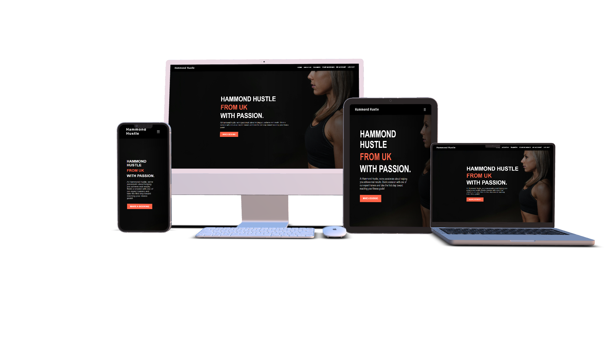

Click the link to view the live app [Hammond Hustle](https://hammond-hustle-6962877d2ab9.herokuapp.com/)

Achieve your fitness goals by unlocking your true potential!

Welcome to Hammond Hustle, the go-to fitness site for individuals committed to their health and wellness. Built on the powerful Django framework, this app allows you to book personalized training sessions with our expert trainers, tailored to meet your fitness goals. Users can create profiles, track bookings, and stay organized with an easy-to-use scheduling system. Whether you’re just starting out or looking to elevate your performance, Hammond Hustle offers the guidance and expertise you need to succeed. Join today to train with our specialists and take the next step in your fitness journey.

***

## Contents

## Project Aims
- Provide a platform for users to book personalized training sessions with expert trainers.

- Allow users to manage bookings after the booking has been completed.

- Offer a visually appealing and user-friendly interface that makes navigation seamless and booking sessions straightforward.

- Ensure the app is scalable, with the capability to accommodate a growing number of users, trainers, and bookings over time.

- Offer robust security features to protect user data, ensuring compliance with privacy regulations and providing a safe user experience.

- Continuously improve the app through regular updates, feature enhancements, and bug fixes based on user feedback.

Overall, the goal of Hammond Hustle is to offer an accessible, professional booking system for fitness enthusiasts to connect with specialist trainers and make consistent progress toward their health and fitness goals.

## How to use it

Here are the steps to use **What's Cooking**:

1. Create an account: To get started, you will need to create an account by entering your email address, and password.

2. Update your profile: After creating an account, you can update your profile information, with personal information, such as your name, to help others get to know you better.

3. Make a booking: navitage to the make a make a booking screen where you can enter your details, chose your coach and get booked in for a session.

4. Edit a booking: navigate to the your bookings screen, if you want to change the date or time of a booking or even cancel the booking altogether, you can do so in here.

With these steps, you should be able to easily use **Hammond Hustle** to find, create and edit bookings.

## Design
### ERD
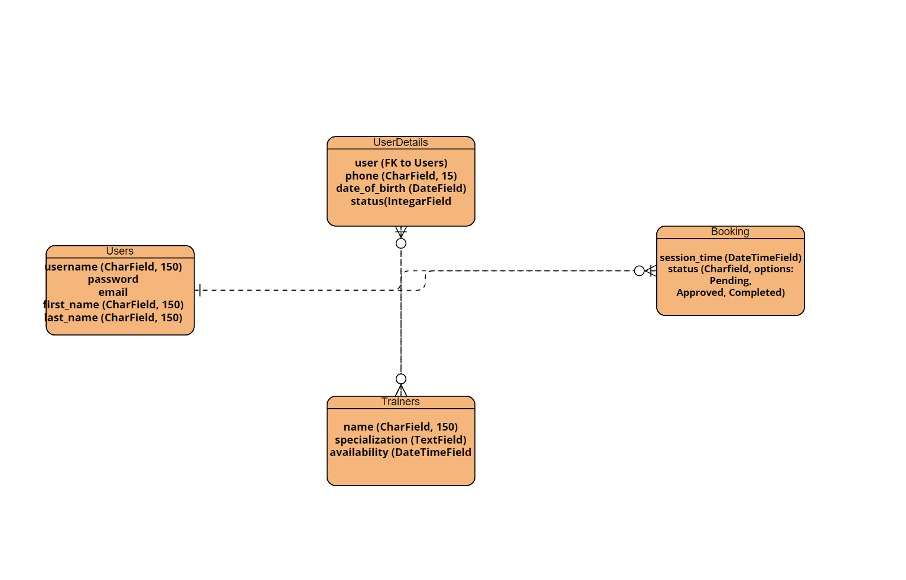

### Wireframes
#### Index / Homepage
Mobile

Click to view

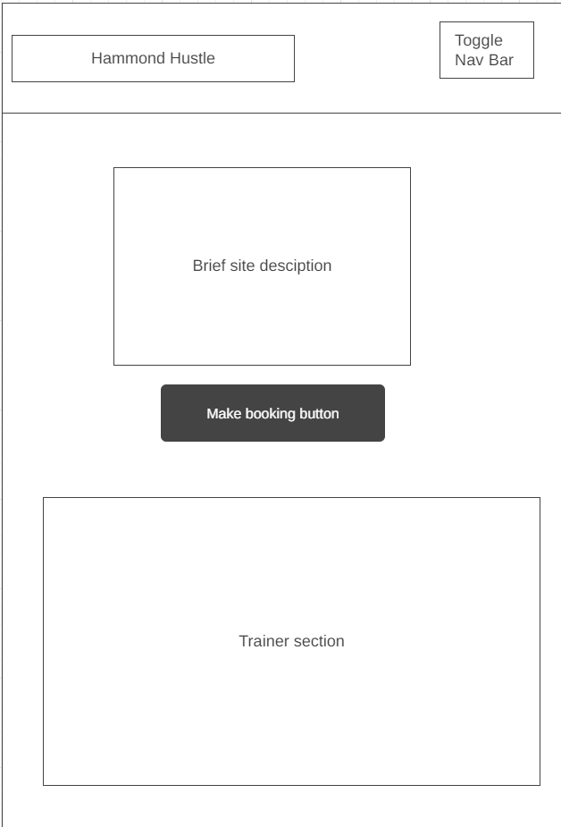

Desktop

Click to view

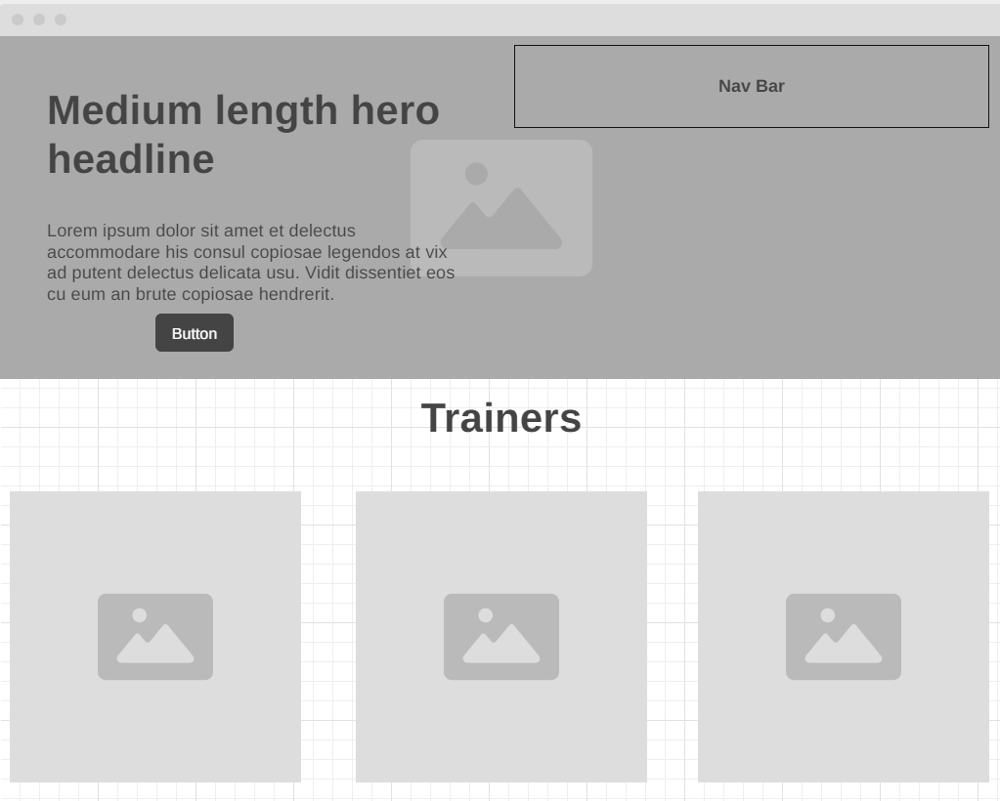

#### Login
Mobile

Click to view

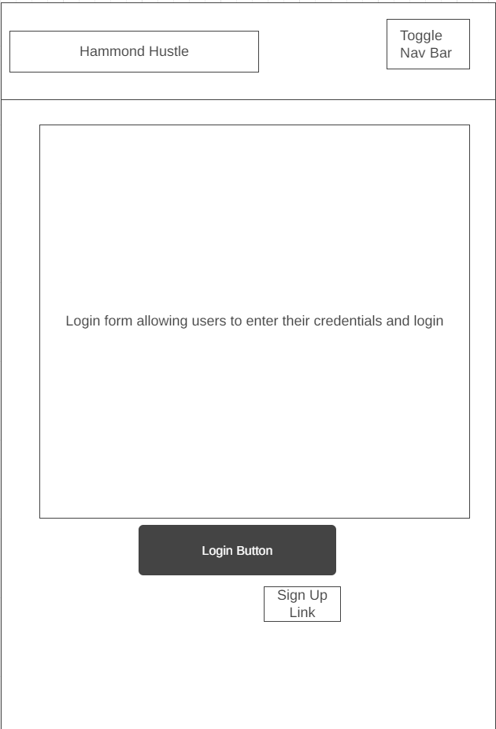

Desktop

Click to view

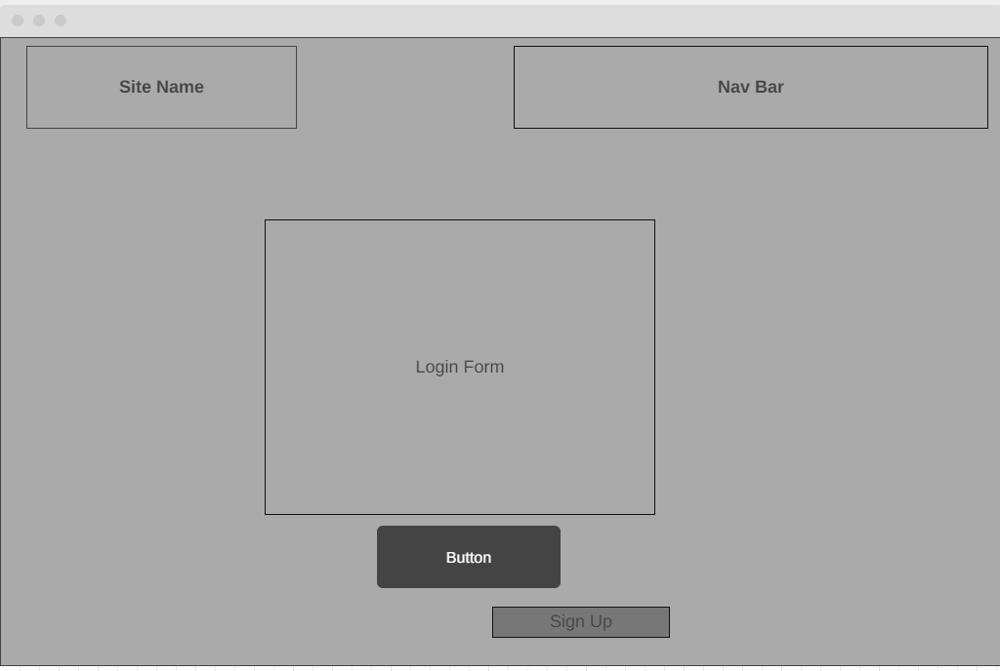

#### Signup
Mobile

Click to view

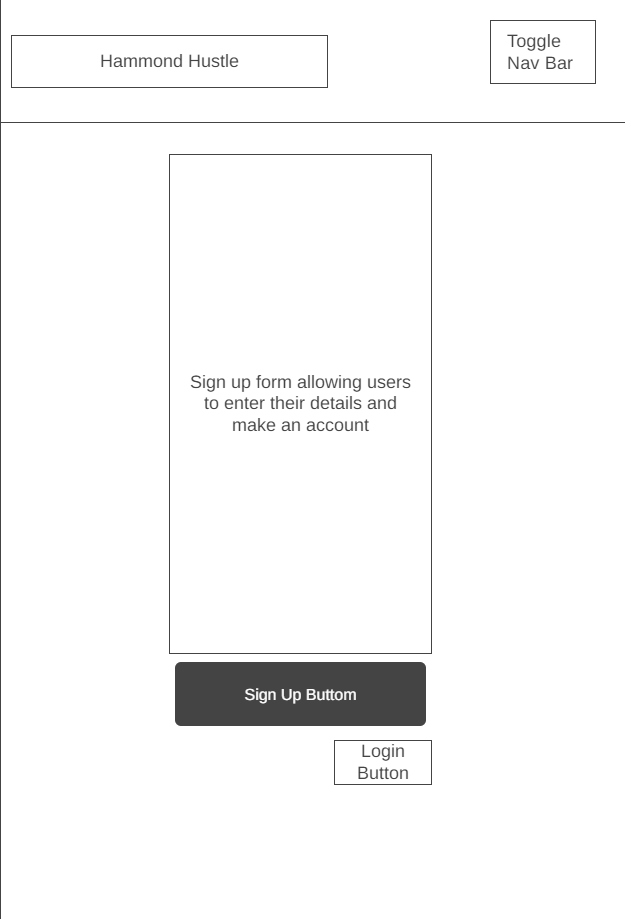

Desktop

Click to view

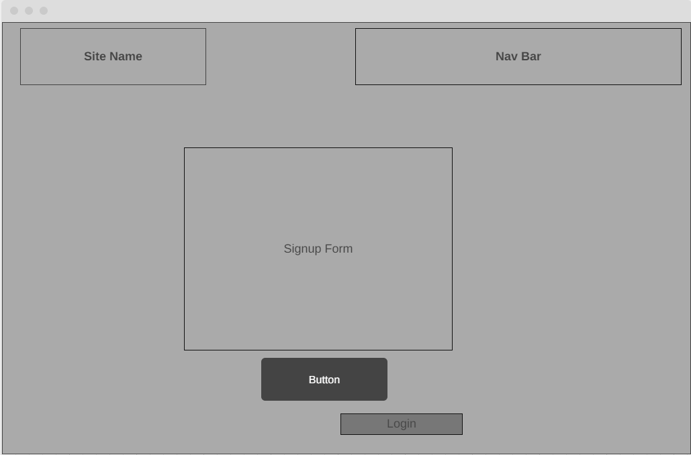

#### Your Booking
Mobile

Click to view

Desktop

Click to view

#### My Account
Mobile

Click to view

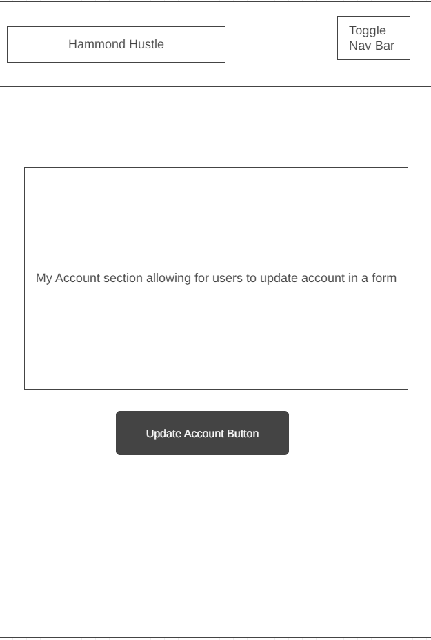

Desktop

Click to view

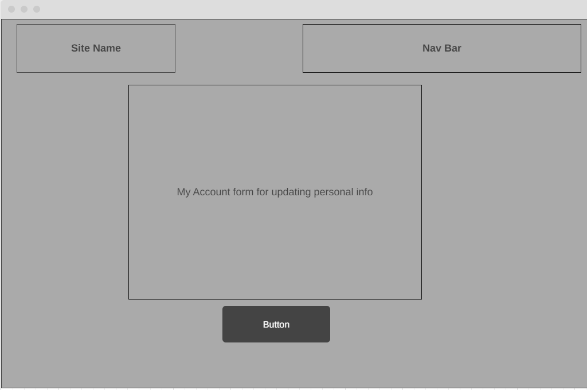

#### Create Booking
Mobile

Click to view

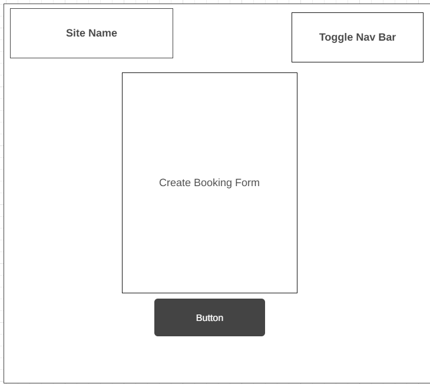

Desktop

Click to view

### Navigation / Flow Plan
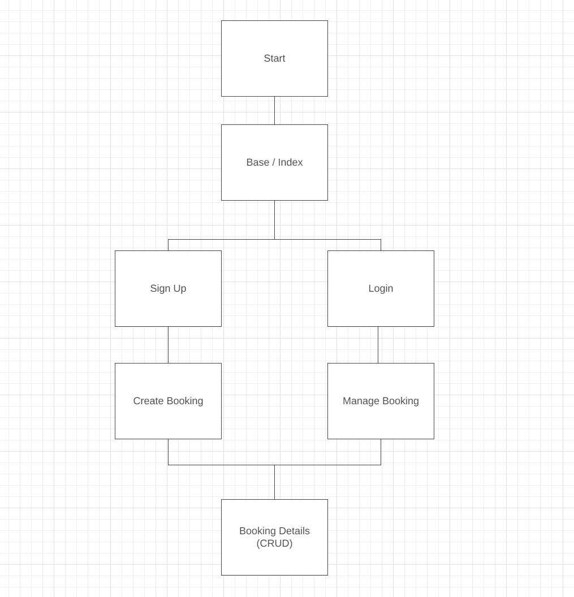
