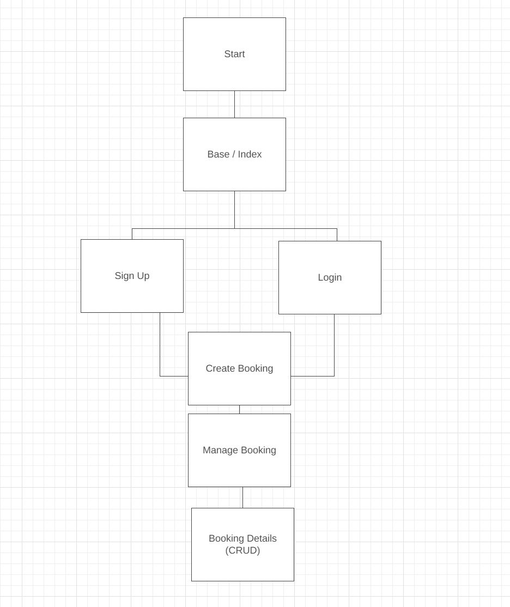
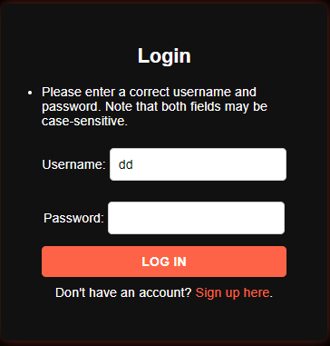
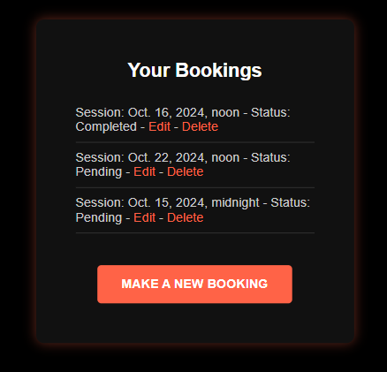
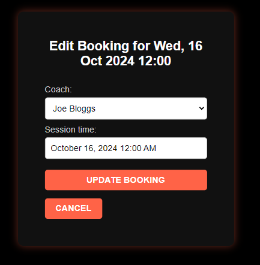
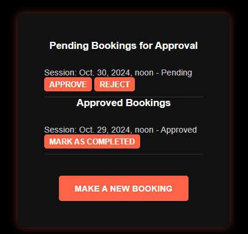
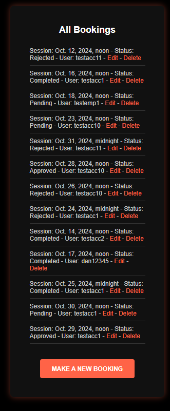

# Hammond Hustle!

Click the link to view the live app [Hammond Hustle](https://hammond-hustle-6962877d2ab9.herokuapp.com/)

Achieve your fitness goals by unlocking your true potential!

Welcome to Hammond Hustle, the go-to fitness site for individuals committed to their health and wellness. Built on the powerful Django framework, this app allows you to book personalized training sessions with our expert trainers, tailored to meet your fitness goals. Users can create profiles, track bookings, and stay organized with an easy-to-use scheduling system. Whether you’re just starting out or looking to elevate your performance, Hammond Hustle offers the guidance and expertise you need to succeed. Join today to train with our specialists and take the next step in your fitness journey.

***

## Contents

## Project Aims
- Provide a platform for users to book personalized training sessions with expert trainers.

- Allow users to manage bookings after the booking has been completed.

- Offer a visually appealing and user-friendly interface that makes navigation seamless and booking sessions straightforward.

- Ensure the app is scalable, with the capability to accommodate a growing number of users, trainers, and bookings over time.

- Offer robust security features to protect user data, ensuring compliance with privacy regulations and providing a safe user experience.

- Continuously improve the app through regular updates, feature enhancements, and bug fixes based on user feedback.

Overall, the goal of Hammond Hustle is to offer an accessible, professional booking system for fitness enthusiasts to connect with specialist trainers and make consistent progress toward their health and fitness goals.

## How to use it

Here are the steps to use **What's Cooking**:

1. Create an account: To get started, you will need to create an account by entering your email address, and password.

2. Update your profile: After creating an account, you can update your profile information, with personal information, such as your name, to help others get to know you better.

3. Make a booking: navitage to the make a make a booking screen where you can enter your details, chose your coach and get booked in for a session.

4. Edit a booking: navigate to the your bookings screen, if you want to change the date or time of a booking or even cancel the booking altogether, you can do so in here.

With these steps, you should be able to easily use **Hammond Hustle** to find, create and edit bookings.

## User Stories & Epics
All user stories were entered as issues in a GitHub Kanban project follow the link to see the project:
[Project Link](https://github.com/users/Brad-Hammond/projects/2)

### Epic: Booking: The ability for users to create and manage their own bookings, including updating the date if needed.
- [3]- As a user I can book and manage sessions so that I can tailor them to my needs
- [9] - As a User I can edit the date and time of a booking to better suit my needs

### Epic: Prebooked Days: The ability for users to not be able to book prebooked days.
- [6]- As a user I can see if a session time has already been booked so that I do not double book a time with a coach

### Epic: Employee View: The ability for employees to manage / approve users bookings.
- [7]- As a employee I can see my own bookings so that I do not see my colleagues bookings
- [10]- As a employee I can mark a booking as completed so that the employee knows the booking is completed
- [4]- As a employee I can accept or reject user bookings so that I can fit the booking in with other clients

### Epic: Login and Singup: The ability for users to login and signup.
- [1]- As a site user I can sign up and log in so that i can make an account on the site

### Epic: Admin View: The ability for admins to have all levels of access.
- [2]- As a admin I can access all other levels of access so that I can check on the site overall

### Epic: Good UX Practice: The ability for users to stay on the same browser across the site.
- [8]- As a user I can stay on the same browser tab across the site so that I do not get confused of being on a different browser

### Incomplete User Stories for future developement
- [5]- As a employee I can leave feedback on a users session so that they can improve for next time

## Design
### ERD

### Wireframes
#### Index / Homepage
Mobile

Click to view

Desktop

Click to view

#### Login
Mobile

Click to view

Desktop

Click to view

#### Signup
Mobile

Click to view

Desktop

Click to view

#### Your Booking
Mobile

Click to view

Desktop

Click to view

#### My Account
Mobile

Click to view

Desktop

Click to view

#### Create Booking
Mobile

Click to view

Desktop

Click to view

### Navigation / Flow Plan

## Features
### Existing Features
Below are the main features of Hammond Hustle.

### Users

#### Base
##### NavBar
- The company name is visible on all nav bar sizes.
- The nav bar has a toggle feature on smaller devices.
- When a user is logged in, the nav features different links for authenticated users only.

##### Hero Image / Button
- At the top of the base/index page, there is a make a booking button.
- If not logged in, this redirects the user to the login page.

##### Trainer Section
- The trainer section includes images of the trainers.
- On desktop, they also have a hover animation.
- The nav link correctly links to this section on all files.

##### About Section
- The about section includes a small paragraph about the company.
- The nav link correctly links to this section on all files.

#### Signup / Login
##### Signup
- The signup form informs the user of what data each input field requires.
- If the user is an employee, they can enter their employee code here.
- If the user enters incorrect details or misses a section, it pops up with an error message.

##### Login
- The login form requires correct username and password.
- If incorrect details are entered, a message appears and the user must retry.

#### Bookings
##### Create Booking Form
- The create booking includes numerous input fields for the user to fill.
- All data fields must be filled otherwise the same error message with the signup form will appear.
- The DOB and Session date and time use a calender picker to make it easier for users.
- When a user choses a time with a specific coach, if that day is already booked - it will be greyed out on the calender.
- Bookings with coaches last all day so you cannot have multiple times on one day per coach.

##### Your Bookings
- The your booking screen has all bookings for that user.
- The status will be pending until a coach (employee) approves it.
- Once a booking is approved, the status changes from pending to approved.

##### Edit Booking
- The edit booking screen allows the user to edit a booking which has already been booked.
- Like the create booking form, the dates are greyed out with already booked sessions.

#### Account
##### My Account
- The my account section allows users to update their personal info.
- Again, if not filled out correctly or a datafield is missing info, an error mesage will appear.

### Employee

##### Your Booking
- On the your booking screen for employees, their view is simlar.
- However, on theirs they can see users who want to book with them.
- Employees can reject, approve, and once approved they can mark as completed.

### Admin

##### Your Booking
- As the admin, they can see all bookings, apprvoed, completed or rejected.
- They also have the option to delete or edit these.

### Future Features
#### Leave and View Feedback
- This was a feature which I wanted to implement however it fell out of scope due to time constraints.
- This feature would allow employees to leave feedback on the session for users and then users could view this feedback.

#### Coach Videos
- This feature would have a section on the page of coaches going over some basic tips and tricks.
- Due to time constraints I could not implement this feature but it will be added in the future.

#### Profile Pictures
- This feature would allow users to upload a profile picture to the site.
- Due to time constraints I could not implement this feature but it will be added in the future.

***

## Technologies Used

- HTML5
- CSS3
- Python
- Javascript
- django-allauth
- django-crispy-forms
- Postgre

## Testing

A separate testing document has been created as [TESTING.md](TESTING.md)