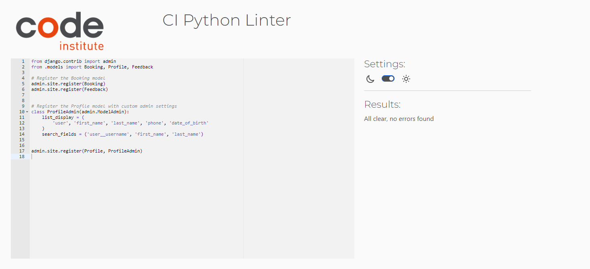

# Hammond Hustle

[<< Back to ReadMe](README.md)

I have 3 tests covering the critical views and functionalities of my site.

***

## Manual Tests
Manual testing occurred regularly throughout local development. Tests are documented below.

### index
|Test #|Test|Results|Evidence|
| --- | --- | --- | --- |
|1|Nav bar shortens when screen size is smaller|Pass|The nav has a toggle when on smaller screens 
 
 |
|2|Login/ Sign up button disappears when user is logged in|Pass| the button on the index page disappears when the user is logged in and shows up if the user has not been authenticated 
 
 |

### Login
|Test #|Test|Results|Evidence|
| --- | --- | --- |--- |
|1| login form has the correct validation|Pass| a user must fully enter all details corretly before logging in|

### Signup
|Test #|Test|Results|Evidence|
| --- | --- | --- |--- |
|1| signup form has the correct validation|Pass| a user must fully enter all details corretly before signing up|

### My Account
|Test #|Test|Results|Evidence|
| --- | --- | --- |--- |
|1| my account form has the correct validation|Pass| a user must fully enter all details corretly before the form is submitted|

### Create Booking
|Test #|Test|Results|Evidence|
| --- | --- | --- |--- |
|1|create booking form has the correct validation|Pass| a user must fully enter all details corretly before the booking is created|
|2|users cannot double book on sessions|Pass| days which are already booked are greyed out and not bookable|

### Your Bookings
|Test #|Test|Results|Evidence|
| --- | --- | --- |--- |
|1|As a user, I can see my bookings, at any stage (rejected, accepted etc)|Pass| a user can see all bookings|
|2|As a user, they can edit or delete their bookings|Pass| next to their booking info is links for editing or deleting bookings|
|3|As a employee, they can accept, reject and mark bookings as completed|Pass| next to the booking info is the option to reject or accept. Once accepeted they can mark as completed|
|4|As a admin, see all bookings and also edit or delete these|Pass| all bookings are visible and editing and viewing is possible|

### Edit Booking
|Test #|Test|Results|Evidence|
| --- | --- | --- |--- |
|1|When editing a booking, prebooked days are greyed out|Pass| booked days are greyed out|

### Other Manual Tests
- I have checked each different access level (user, employee, admin) to make sure each one can only see what they are supposed to.
- Users can see the bare minimum, only being able to create, read, edit and delete bookings.
- Employees can do all of the above + approve, reject and mark a session as completed.
- Admins have views of all bookings with CRUD functionality.
- Users cannot see what the employees can see, employees cannot see what the admin can see.

## User Story Testing

[Project Stories](https://github.com/users/Brad-Hammond/projects/2)

[User story 1] - I know I am done with the 'As a site user I can sign up and log in so that i can make an account on the site' user story when as a user I can signup and login on the site - PASS

[User story 2] - I know I am done with the 'As a admin I can access all other levels of access so that I can check on the site overall' user story when as a admin I have access to do all things the other users can - PASS

[User story 3] - I know I am done with the 'As a user I can book and manage sessions so that I can tailor them to my needs' user story when as a user I can create bookings and manage these (CRUD) - PASS

[User story 4] - I know I am done with the 'As a employee I can accept or reject user bookings so that I can fit the booking in with other clients' user story when as a employee I can accept or reject bookings - PASS

[User story 5] - This fell out of scope due to time constraints.

[User story 6] - I know I am done with the 'As a user I can see if a session time has already been booked so that I do not double book a time with a coach' user story when as a user I cannot book on days which have already been booked - PASS

[User story 7] - I know I am done with the 'As a employee I can see my own bookings so that I do not see my colleagues bookings' user story when as a employee I cannot see other coaches bookings - PASS

[User story 8] - I know I am done with the 'As a user I can stay on the same browser tab across the site so that I do not get confused of being on a different browser' user story when as a user I stay on the same browser across the site - PASS

[User story 9] - I know I am done with the 'As a User I can edit the date and time of a booking to better suit my needs.' user story when as a user I can edit the date and time of bookings - PASS

[User story 10] - I know I am done with the 'As a employee I can mark a booking as completed so that the employee knows the booking is completed' user story when as a employee I can see and press the mark as completed button - PASS

***

## Code Validation

### HTML

#### Index

https://validator.w3.org/nu/?showsource=yes&showoutline=yes&showimagereport=yes&doc=https%3A%2F%2Fhammond-hustle-6962877d2ab9.herokuapp.com%2F#l441c6

#### Signup

https://validator.w3.org/nu/?showsource=yes&showoutline=yes&showimagereport=yes&doc=https%3A%2F%2Fhammond-hustle-6962877d2ab9.herokuapp.com%2Fbookings%2Fsignup%2F#l441c6

#### Login

https://validator.w3.org/nu/?showsource=yes&showoutline=yes&showimagereport=yes&doc=https%3A%2F%2Fhammond-hustle-6962877d2ab9.herokuapp.com%2Faccounts%2Flogin%2F#l441c6

#### My Account

https://validator.w3.org/nu/?showsource=yes&showoutline=yes&showimagereport=yes&doc=https%3A%2F%2Fhammond-hustle-6962877d2ab9.herokuapp.com%2Fbookings%2Fmy_account%2F#l441c6

#### Create Booking

https://validator.w3.org/nu/?showsource=yes&showoutline=yes&showimagereport=yes&doc=https%3A%2F%2Fhammond-hustle-6962877d2ab9.herokuapp.com%2Fbookings%2Fcreate_booking%2F#l441c6

#### Your Booking

https://validator.w3.org/nu/?showsource=yes&showoutline=yes&showimagereport=yes&doc=https%3A%2F%2Fhammond-hustle-6962877d2ab9.herokuapp.com%2Fbookings%2Fmanage_bookings%2F#l441c6

#### Edit Booking

https://validator.w3.org/nu/?showsource=yes&showoutline=yes&showimagereport=yes&doc=https%3A%2F%2Fhammond-hustle-6962877d2ab9.herokuapp.com%2Fbookings%2Fedit_booking%2F49%2F#l441c6

### CSS

### Javascript
- I used minimal Javascript but all scripts used passed through JSHint with no errors.

### Python

#### admin.py

#### apps.py

#### forms.py

#### models.py

#### urls.py

#### views.py

## Lighthouse/ Accessibility Testing

### Index

### Login

### Signup

### My Account

### Your Booking

### Edit Booking

## Devices used for manual testing
Hammond Hustle was tested using the following desktop and mobile browsers:

### Desktop
- Safari 18.0
- Firefox 131.0.2
- Chrome 129.0.6668.100

### Mobile and Tablet
- Safari iOS 18
- Chrome 129.0.6668.100 for Android

[<< Back to ReadMe](README.md)
